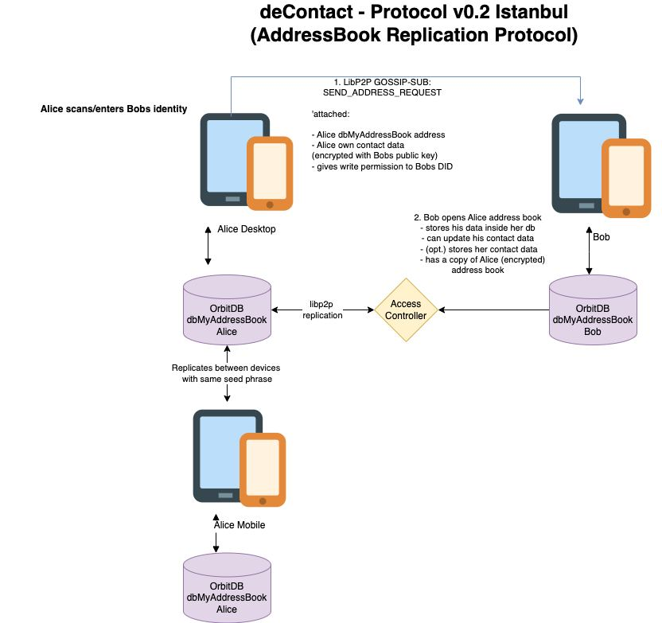

# deContact
A peer-to-peer address book in Svelte with local first protocol built on libp2p, Helia and OrbitDB



## Main Use Case
1. Address books on computers and phones are always outdated. We need a way to automatically update contact data as somebody is moving to a new place.
2. I don't like to host my data on Google, Amazon or Facebook any longer. 

## Features
[x] Onboarding of a new user and account creation 
[x] Backup seed on new device (Auto Device Sync)
[x] Add my own contact data (private, business, other)
[x] Contact List (see my own contact data and others (decentralized and traditional))
    [x] Search in contact list
[x] Request contact data by (scanning a) DID
[x] Answer contact data request and write contact data in requesters db
[x] Update own contact data and write updates into follower dbs
[x] Backup of follower dbs (people who requested our contact data)
10. Backup of followed dbs (people which's contact data we requested)

## Developing
1. Clone this repository
2. npm i 
3. npm run dev

## Building

To create a production version of your app:

```bash
npm run build
```
You can preview the production build with `npm run preview`.


## Tests
```bash
npm run test:e2e   #headless
npm run test:e2e:manual 
```
